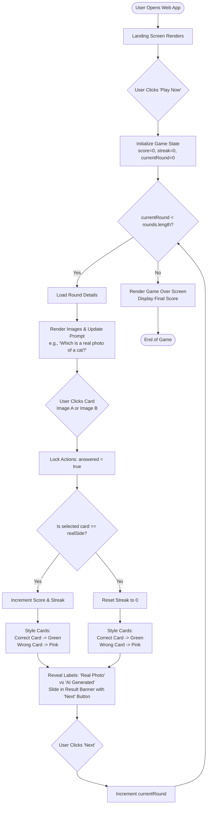
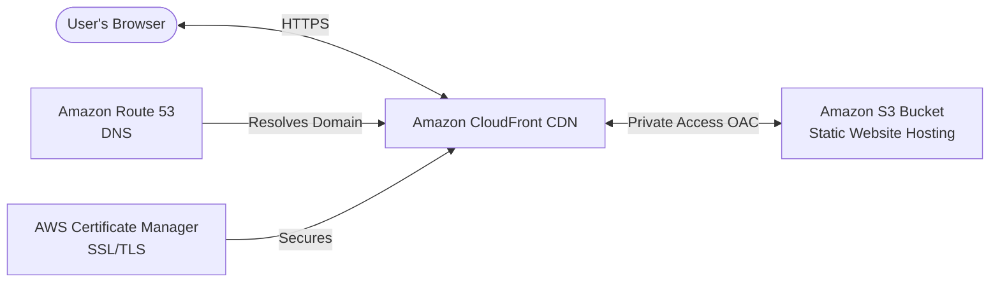
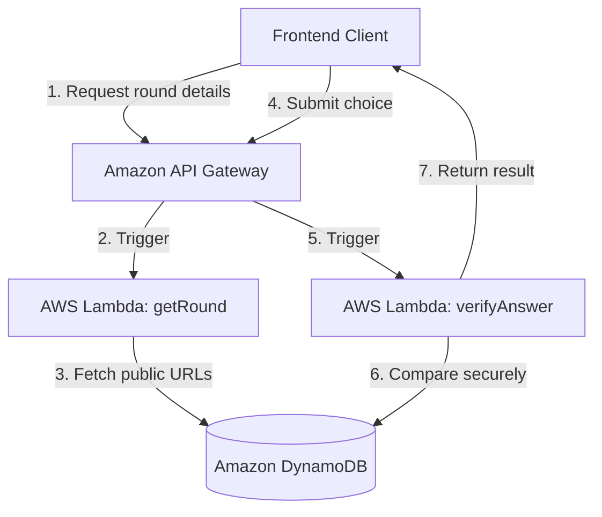

# Project Architecture, Features & AWS Migration Review

This document provides a comprehensive review of the current **Project Antigravity Web App ("Spot the AI Image Challenge")**, analyzes its features, outlines the user interaction flow with a visual flowchart, and provides a road map for migrating the application to Amazon Web Services (AWS) in the future.

---

## 📂 Current Project & Code Structure Review

Currently, the project is a lightweight frontend application contained entirely in a single monolithic file.

### Directory Layout
```
Antigravity-Project/
├── .git/                      # Git repository metadata
├── README.md                  # Project overview, tech stack, and setup instructions
└── spot-the-ai.html           # Unified application file (HTML, CSS, JS, Assets)
```

### Analysis of `spot-the-ai.html`
* **HTML Structure (Lines 552–719)**: Contains semantic HTML5 tags (`<section id="landing">`, `<div id="game">`, `<button>`, etc.) that divide the user experience into a landing screen and an active game viewport.
* **Styling (CSS, Lines 8–550)**: Standard Vanilla CSS written in a `<style>` block.
  * High-fidelity design utilizing modern typography (`Syne` and `DM Mono` loaded from Google Fonts).
  * Custom dark-themed CSS variables (`--bg`, `--surface`, `--accent`, etc.) supporting custom colors (neon lime green and neon pink).
  * A procedural SVG noise grain overlay (`body::before`) and radial background gradients to create a premium, glassmorphism-adjacent aesthetic.
  * Fully responsive container queries and media rules for fluid scaling from mobile screen widths up to high-resolution desktop screens.
* **Aesthetics & Vector Elements**: Employs inline SVG code for logos and icons (like the high-tech circuit eye logo), avoiding external image assets and minimizing page load latency.
* **Logic (JavaScript, Lines 720–838)**: Pure client-side JavaScript.
  * A local `rounds` array storing the prompt subjects, image references, and ground-truth metadata (`realSide`).
  * Basic game state variables: `currentRound`, `score`, `streak`, and `answered`.
  * Core functional callbacks: `startGame()`, `loadRound()`, `setCardImage()`, `handlePick()`, and `nextRound()`.

---

## 🎨 Feature Inventory

| Feature Area | Description | Current Status |
| :--- | :--- | :--- |
| **Immersive Landing Screen** | High-impact UI featuring an interactive SVG circuit logo, striking typography, and custom neon visual badges identifying the rules. | Fully Functional |
| **Dynamic Quiz Gameplay** | Side-by-side card slots presenting the user with two images (Image A & Image B) along with a descriptive prompt prompt detailing the target subject. | Fully Functional |
| **Instant Interactive Feedback** | Once selected, cards immediately transition to show correct (green) or wrong (pink) borders. Floating reveal badges (`✓ Real Photo` / `✦ AI Generated`) slide into view. | Fully Functional |
| **Score & Streak Tracker** | Persistent dashboard indicators showing the player's total correct answers (Score) and consecutive correct answers (Streak). Streaks reset on error. | Fully Functional |
| **Fluid Mobile Layout** | Adaptive layout that stacks the side-by-side image cards vertically on smaller viewports and hides non-essential decorators to prioritize gameplay. | Fully Functional |
| **Procedural Audio/Visual FX** | Visual indicators, micro-animations (card hover scaling, translation animations, result banner slide-in), and noise-grain filters. | Visuals active; Audio not yet implemented |

---

## 📊 User & Application Interaction Flow

The diagram below details the operational states of the application and how the user interacts with the system at each step.



---

## ☁️ Future AWS Hosting Preparation Plan

To transition this project from a local, single-file prototype into a robust, high-performance, and secure web application deployed on **Amazon Web Services (AWS)**, we recommend a phased modernization workflow.

### 🧱 1. Codebase Refactoring & Componentization
Before deploying to production cloud infrastructure, we should decouple the monolithic file to allow scalability:
* **Separation of Concerns**: Splitting the file into modular, clean files:
  * `index.html` — Document skeleton and root containers.
  * `src/styles/main.css` — Global stylesheets, layout variables, animations, and CSS custom properties.
  * `src/js/game.js` — Core game loops and UI controllers.
  * `src/js/roundsData.js` — Client-side round definitions.
* **Modern Build Tooling (Vite)**: Scaffold the project with a lightweight developer build tool (e.g. `Vite`). This enables:
  * Hot Module Replacement (HMR) for rapid development.
  * Asset optimization (minification of JS/CSS, automatic image compression).
  * Environment variable management (important for API endpoints).

### 🚀 2. Frontend Cloud Architecture (S3 + CloudFront)
The frontend is client-side, making serverless static hosting the fastest and most cost-effective hosting model on AWS.



* **AWS S3 (Simple Storage Service)**: Holds the compiled frontend static files (`dist` directory). S3 offers virtually infinite scalability and 99.999999999% durability.
* **Amazon CloudFront (CDN)**: Serves files globally from edge locations closest to the user. This guarantees ultra-low latency, protects the S3 bucket from public access via Origin Access Control (OAC), and handles SSL/TLS termination.
* **AWS Certificate Manager (ACM) & Amazon Route 53**: Provisions free SSL certificates and connects a custom domain name (e.g., `spot-the-ai.com`).

### 🔒 3. Backend Modernization (AWS Lambda Serverless API)
**The Anti-Cheat Challenge**: Currently, a user can open their browser's inspect tool, look at the `rounds` variable, and instantly see the correct answers (`realSide`).
To solve this, we should migrate to a **Serverless Backend**:



* **Amazon DynamoDB**: A fully-managed, high-performance NoSQL database to store hundreds of rounds (round IDs, image URLs, description prompts, and the secure answer mapping).
* **AWS Lambda**: Run serverless Node.js functions (e.g., `getRound` and `verifyAnswer`).
  * `getRound` returns a round prompt and the two image URLs but *does not* expose which side is real.
  * `verifyAnswer` receives the user's choice, checks it securely on the server side, and returns whether it was correct.
* **Amazon API Gateway**: Sets up secure HTTPS endpoints for the frontend to communicate with the Lambda functions.

### 🔄 4. Automated CI/CD Deployment Pipeline
To ensure seamless updates whenever developers make changes:
* **GitHub Actions + AWS OIDC**: Set up a continuous deployment workflow. When changes are merged into the `main` or production branches:
  1. Trigger automated linting and quality checks.
  2. Compile static assets (Vite build).
  3. Upload the build output directly to the AWS S3 bucket.
  4. Invalidate the Amazon CloudFront cache so players instantly see the updated version.
